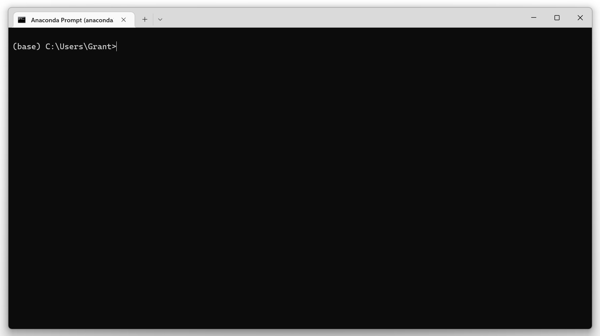
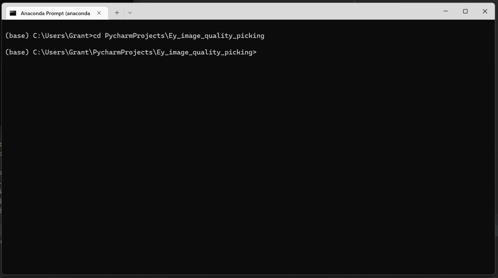
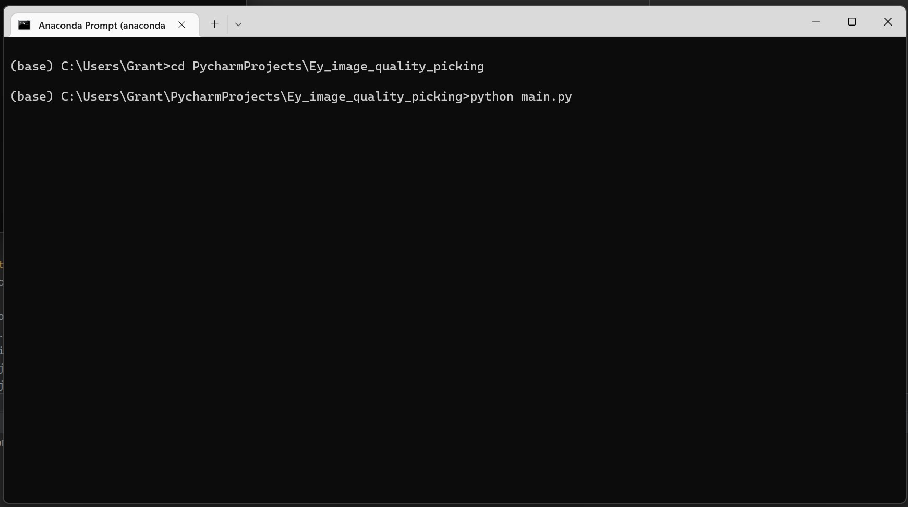
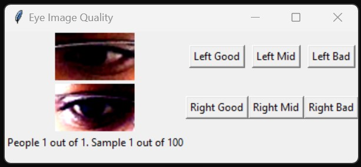
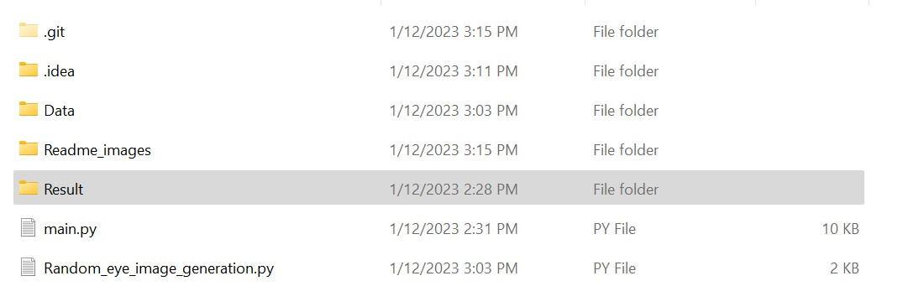

# Eye_image_quality_picking
<!--  -->

The program works the best with Anaconda install. 
To install Anaconda, go to https://www.anaconda.com/ and download the correct version

 
To run the program:  
1. Launch an Anaconda command window  

 
 
2. Navigate to the folder where the "main.py" is located using 'cd' command 

 
3. Launch the main program by typing 'python main.py'

 
4. If everything is setup correctly, the following window will pop up

 

5. The results are stored in csv, and will be saved in a folder called "Result" in the same directory as "main.py"

 
